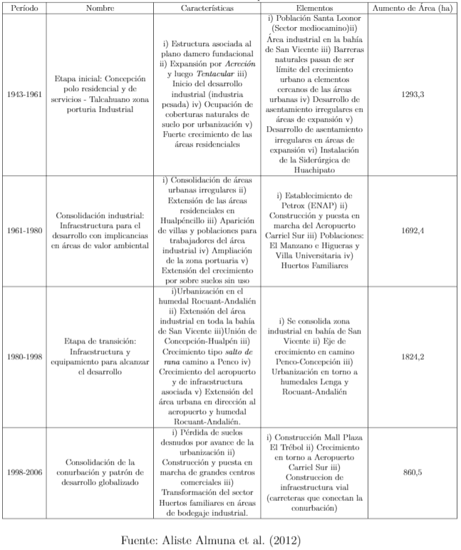

# Contexto histórico económico

Luego de que las políticas de desarrollo adoptadas en el general de América Latina después de la segunda guerra mundial, que apuntaban al modelo económico de industrialización por sustitución de importaciones (ISI) - sostenida por barreras tarifarias con el objeto de promover el crecimiento sostenido y la creación de empleo - existió un rol de las corporaciones multinacionales que saltaron las varreras tarifarias para jugar el papel de vector de desarrollo económico al interior de los mercados nacionales. A lo anterior se le suma la industrialización con uso intensivo de capital cambiando el modelo de desarrollo al interior de los mercados nacionales.

Entre los años 30 hasta finales de los 70's, la aplicación de dichas políticas, a nivel urbano, se resumen en un rápido proceso de urbanización en el cual se observa el proceso de migración que permitió el crecimiento y el aumento de la primacía urbana de una o dos ciudades en varios múltiplos a las cercanas ya existentes. Dentro de dichas ciudades principales, surge la clase trabajadora moderna industrial y legalmente protegida junto con la clase media empleada en servicios gubernamentales e industrias privadas.

Como producto de estas políticas, en las grandes ciudades el crecimiento poblacional presionó el mercado de tierras y viviendas, dejando que los precios sobrepasaran la capacidad de ingresos percibidos por los trabajadores vinculados con la industria formal como a los informales. Así las clases trabajadoras fueron entonces forzadas a crear sus propias soluciones habitacionales dentro de un vasto y rápido crecimiento de barriadas y asentamiento irregulares en la periferia de las ciudades.

Parte de la actual estructura urbana que hoy vemos proviene de los asentamientos de la clase trabajadora en la periferia urbana, donde también las élites y la clase media abandonaron el centro de la ciudad relocalizándose en áreas alejadas de las ocupadas por los pobres [@portesciudad].

# Concepción como polo de desarrollo nacional en el contexto de las ISI

En el estudio titulado *La dinámica del territorio en la conurbación Concepción-Talcahuano: huellas urbanas para una interpretación de las transformaciones ambientales durante mitad del siglo XX* [@aliste2012dinamica], encontramos un muy buen resumen tanto de los procesos desarrollistas como de los urbano-morfológicos del actual AMC.

La descripción de los procesos históricos del área comienzan en 1939 con el terremoto de Chillán y la creación de la CORFO que tenía el fin de incentivar y fortalecer la industria manufacturera nacional. Para ello hace inicio de las actividades de la Compañía de Aceros del Pacífico (CAP) en 1950. Concepcion por dichos años era mirado como un polo de desarrollo nacional en el cual su posición y equipamiento eran estratégicos en cuanto a la bahía de San Vicente (por su potencial portuario), la red de caminos y ferrocarriles, la extracción de carbón de Lota y Coronel más el potencial hidroeléctrico del río Bío-Bío

Tan intenso fue el proceso de modernización, que en el período intercensal de 1940-1952 fue el donde mayor velocidad tuvo el crecimiento poblacional, el cual se explica por la reorientación industrial que tuvo dicha conurbación en esos años.

Como consecuencia de este proceso de crecimiento se tiene una concentración en un sector que de por sí es reducido y que, más aún, es morfológicamente complejo. Sin embargo la tendencia a seguir generando presiones sobre el suelo urbano, muestra el hecho a que éste permanezca saturado en las zonas centrales del AMC. Por último el mismo estudio presenta el siguiente resumen de como han sido las transformaciones espaciales solamente en la conurbación:

# Fin del modelo ISI. Imposición de las políticas neoliberales y su expresión espacial

A partir de la crisis mexicana del petróleo como también un factor del fin de la ISI y la imposición del libre mercado desde los primeros años de dictadura, los objetivos directivos de dichos estados se enfocaron resumidamente, según [@portesciudad], en:

- Apertura unilateral del comercio exterior
- Extensa privatización de las empresas del Estado
- Desregulación de bienes, servicios y mercados laborales
- Liberalización de mercados de capital con privatización de los fondos de pensiones
- Ajuste Fiscal basado en una reducción drástica del gasto público
- Reestructuración de programas estatales, focalizándose en esquemas compensatorios para los grupos más necesitados
- Fin a la política industrial y cualquier otra forma de empresarialidad patrocinada por el Estado y concentración en la gestión Macroeconómica

Las actividades del nuevo modelo no precisaban de concentración en grandes urbes, sino que solo se necesita cercanía a los lugares de exportación, reduciendo costos de los lugares de exportación aumentando las ganancias; y por último, como consecuencia de lo anterior, en visto de la reducción del atractivo de las ciudades altamente primadas como fuentes de empleo y surgimiento de nuevos polos de crecimiento asociados a dichas exportaciones y el turismo, se pronunciaría un aumento de las ciudades secundarias donde nuevas inversiones podrían ser colocadas.

Después de ese período de ajuste, la reducción de la demanda laboral debería ser superada por industrias competitivas orientadas a la exportación y asociadas a los servicios. Teóricamente, en el contexto de libre mercado, con menos impuestos y regulaciones podría estimular inversiones de capital produciendo a su vez un repunte en la demanda laboral. Entonces, para promover dichos resultados, los gobiernos tomaron las políticas de flexibilización laboral que redujeron la seguridad y los beneficios sociales anteriores ganados. Como consecuencia entonces se cita:

*"Los impactos más positivos (de las políticas de apertura de mercados) beneficiaron a aquellos sectores que ya estaban en los escalones más altos de la distribución de ingreso. Se favoreció la riqueza. Los efectos negativos tuvieron lugar en los mercados laborales como resultado de la aplicación de estas políticas: precarización del trabajo, informalización y desempleo. Estos efectos se han manifestado primordialmente en los sectores que ya eran pobres. De esta manera ha crecido la desigualdad"* [@portesciudad].

# Desregulación, mercados de trabajo, ciudad desigual

Las políticas de liberalización, desregulación y flexibilización en conjunto con la tercerización de la economía, dan pie a procesos de desestructuración de los regímenes laborales existentes, lo que incide en la creciente des-salarización y precarización de la fuerza de trabajo como un fin al trabajo asalariado estable y bien remunerado. Con ello una acentuación de las desigualdades sociales bajo formas de segregación, fragmentación y tugurización en las aglomeraciones urbanas grandes [@mattos2006].

En resumen, los diversos estudios realizados sobre los cambios en los países de América Latina durante la época de los 90's indican un conjunto de rasgos que condicionan las grandes urbes:

- Disminución del empleo en comparación a décadas anteriores a los 80's
- El empleo nuevo se concentra casi exclusivamente en el sector terciario
- La creación de empleos es insuficiente en relación con el aumento de la PEA
- El desempleo afecta en su mayoría a mujeres y jóvenes

Lo que está fuera de discusión es que la persistencia de las desigualdades constituye un rasgo inseparable del escenario urbano resultado de una metamorfosis en la cual riqueza, pobreza y exclusión social aparecen como componentes combinados. Se observa por un lado una tendencia a la acentuación de la homogeneidad socioeconómica en los barrios ricos producto de la preferencia de sus habitantes por vivir tan alejados como sea posible de la gente que no es de su clase (de las `clases peligrosas`) y en proximidad de sus iguales. ***La homogeneidad social de los barrios ricos permite tomar conciencia de la ambivalencia de la agregación y búsqueda de sus similares*** [@mattos2006]:

*El concepto de comunidad que buscan equivale a aislamiento, separación, muros protectores y cámaras de vigilancia", que tiene como consecuencia la autoguetización materializada en la explosión de los condominios y barrios cerrados como expresión de una discontinuidad o del tejido urbano con vacíos no urbanizados ni, ahora, urbanizables, señala el mismo autor. No obstante el producto "comunidad" se ha transformado en uno de los más promovidos por la oferta inmobiliaria*

# Negocios Inmobiliarios

Otra tendencia que se observa en los patrones políticos de las manifestaciones del desarrollo urbano es la progresiva vigencia del criterio de subsidiaridad más el aumento de la movilidad de capital producido por la liberalización económica, del cual basta cantidad se invierte en la expansión de las grandes ciudades. Esto lleva a que la plusvalía urbana gane creciente importancia en términos urbanísticos y a que las inversiones privadas inmobiliarias pasen a ser directriz urbano actual. En resumen de ellos:

item Abandono de la concepción de la planificación racionalista dejándola en directrices privadas con criterios de `neutralidad` subsidiada por el Estado

- A partir de los años 70's se desencadena la financierización de la economía mundial, desregulando, privatizando y liberalizando significativamente la oferta inmobiliaria

- Aumento significativo en la oferta inmobiliaria privada a partir de las estrategias del ``city marketing" para atraer inversión extranjera

De forma lamentable, esto se traduce en el abandono de la planificación normativa clásica de mediados del siglo XX y es reemplazada por capital privado subsidiado por el estado [@mattos2006]. 

# Explosión de la movilidad, nueva morfología urbana

Esta última tendencia está directamente relacionada con las Tecnologías de la Información Computacional (TIC) las cuales provocaron (y siguen provocando) una radical mutación de la morfología urbana, marcada por procesos de periurbanización y policentralización:

*Actualmente los nuevos campos de externalidad no tienen ya una forma de área compacta, ni un radio limitado, sino que se configuran como retículas articuladas en centros y sistemas urbanos pequeños o grandes, en extensiones territoriales macro-regionales* [@mattos2006].

# Referencias