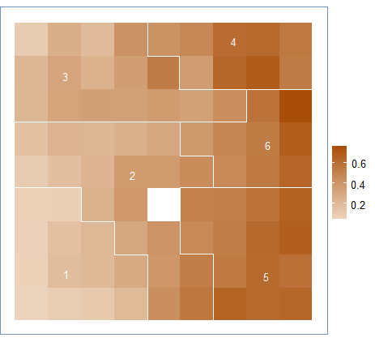

<div class=text-justify>
# Dendrograma

Lo primero a mencionar es que se seleccionaron 6 agrupaciones que hacen sentido  con los grupos esperados
```{r,warning=FALSE,message=FALSE,error=FALSE,include=FALSE}
library(SOMbrero)
library(dplyr)
library(ggplot2)
library(markdown)
library(rgdal)
options(scipen = 999)
set.seed(67)
ANALISIS<-read.csv('data/DB.csv')
SHP<-as.data.frame(readOGR('data/CLUSTER.shp'))
ncel=round(sqrt(5*sqrt(dim(ANALISIS)[1])),digits=0)
training<-trainSOM(x.data=select(ANALISIS,PEJH12,TII,DBI,H,PHZ),
                   dimension=c(ncel,ncel),
                   radius.type='letremy',
                   verbose=TRUE,
                   maxit=5000)
nclass=6
scEST_S7<-superClass(training,k=nclass)
```
```{r,warning=FALSE,message=FALSE,error=FALSE,include=TRUE,echo=FALSE}
plot(scEST_S7)
```


# Boxplot y mapa de calor por cada variable

## Porentaje de jefes de hogar menor a 12 años de escolaridad

```{r,warning=FALSE,message=FALSE,error=FALSE,include=TRUE,echo=FALSE}
boxplot(subset(select(SHP,PEJH14,TII,PHZ,H,DBI),CLUSTER==1)$PEJH14,
        subset(select(SHP,PEJH14,TII,PHZ,H,DBI),CLUSTER==2)$PEJH14,
        subset(select(SHP,PEJH14,TII,PHZ,H,DBI),CLUSTER==3)$PEJH14,
        subset(select(SHP,PEJH14,TII,PHZ,H,DBI),CLUSTER==4)$PEJH14,
        subset(select(SHP,PEJH14,TII,PHZ,H,DBI),CLUSTER==5)$PEJH14,
        subset(select(SHP,PEJH14,TII,PHZ,H,DBI),CLUSTER==6)$PEJH14,
        main="Porcentaje jefes de hogar con escolaridad menor a 12",
        xlab="Cluster",
        ylab="Porcentaje")
```

<center></center>

## Porcentaje de hacinamiento zonal

```{r,warning=FALSE,message=FALSE,error=FALSE,include=TRUE,echo=FALSE}
boxplot(subset(select(SHP,PEJH14,TII,PHZ,H,DBI),CLUSTER==1)$PHZ,
        subset(select(SHP,PEJH14,TII,PHZ,H,DBI),CLUSTER==2)$PHZ,
        subset(select(SHP,PEJH14,TII,PHZ,H,DBI),CLUSTER==3)$PHZ,
        subset(select(SHP,PEJH14,TII,PHZ,H,DBI),CLUSTER==4)$PHZ,
        subset(select(SHP,PEJH14,TII,PHZ,H,DBI),CLUSTER==5)$PHZ,
        subset(select(SHP,PEJH14,TII,PHZ,H,DBI),CLUSTER==6)$PHZ,
        main="Porcentaje hacinamiento zonal",
        xlab="Cluster",
        ylab="Porcentaje")
```

<center></center>

## Tasa de inmigración intrametropolitana

```{r,warning=FALSE,message=FALSE,error=FALSE,include=TRUE,echo=FALSE}
boxplot(subset(select(SHP,PEJH14,TII,PHZ,H,DBI),CLUSTER==1)$TII,
        subset(select(SHP,PEJH14,TII,PHZ,H,DBI),CLUSTER==2)$TII,
        subset(select(SHP,PEJH14,TII,PHZ,H,DBI),CLUSTER==3)$TII,
        subset(select(SHP,PEJH14,TII,PHZ,H,DBI),CLUSTER==4)$TII,
        subset(select(SHP,PEJH14,TII,PHZ,H,DBI),CLUSTER==5)$TII,
        subset(select(SHP,PEJH14,TII,PHZ,H,DBI),CLUSTER==6)$TII,
        main="Tasa inmigración intrametropolitana",
        xlab="Cluster",
        ylab="Porcentaje")
```

<center></center>

## Diversidad de usos de suelo

```{r,warning=FALSE,message=FALSE,error=FALSE,include=TRUE,echo=FALSE}
boxplot(subset(select(SHP,PEJH14,TII,PHZ,H,DBI),CLUSTER==1)$H,
        subset(select(SHP,PEJH14,TII,PHZ,H,DBI),CLUSTER==2)$H,
        subset(select(SHP,PEJH14,TII,PHZ,H,DBI),CLUSTER==3)$H,
        subset(select(SHP,PEJH14,TII,PHZ,H,DBI),CLUSTER==4)$H,
        subset(select(SHP,PEJH14,TII,PHZ,H,DBI),CLUSTER==5)$H,
        subset(select(SHP,PEJH14,TII,PHZ,H,DBI),CLUSTER==6)$H,
        main="Diversidad de usos de suelo",
        xlab="Cluster",
        ylab="Porcentaje")
```

<center></center>

## Distancia a los centros cívicos

```{r,warning=FALSE,message=FALSE,error=FALSE,include=TRUE,echo=FALSE}
boxplot(subset(select(SHP,PEJH14,TII,PHZ,H,DBI),CLUSTER==1)$DBI,
        subset(select(SHP,PEJH14,TII,PHZ,H,DBI),CLUSTER==2)$DBI,
        subset(select(SHP,PEJH14,TII,PHZ,H,DBI),CLUSTER==3)$DBI,
        subset(select(SHP,PEJH14,TII,PHZ,H,DBI),CLUSTER==4)$DBI,
        subset(select(SHP,PEJH14,TII,PHZ,H,DBI),CLUSTER==5)$DBI,
        
        main="Distancia a los centros (bicentros)",
        xlab="Cluster",
        ylab="Porcentaje")
```

<center></center>

</div>