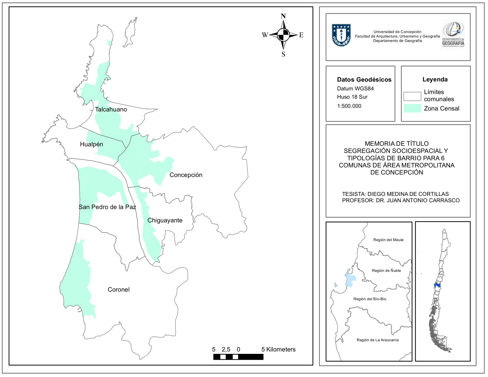

# Introducción

## Resumen
>La siguiente investigación busca caracterizar la segregación socioespacial y la estructura morfológica que presentan 6 comunas del área metropolitana de Concepción. En el desarrollo de la investigación se mostrará el contexto histórico de América Latina y cómo las políticas públicas del siglo XX lograron conformar una ciudad industrializada con consignas de equidad, para posteriormente ser abatidas por políticas de corte neoliberal generando estructuras urbanas segregadoras. Los propósitos de la investigación son cartografiar las zonas segregadas de las comunas y agrupar según características sociodemográficas del área (Escolaridad del jefe de hogar, Tasa de inmigración intrametropolitana, Diversidad de usos de suelo, Hacinamiento, Distancia a los bicentros). Para aquello se ocuparán mapas auto-organizantes que agruparán las zonas más parecidas según su contexto sociodemográfico. Los principales resultados arrojan que en la detección de la segregación se puede categorizar en 6 tipos de barrios los cuales gradualmente se diferencian de mayor a menor calidad de los indicadores, presentando zonas altamente integradas y zonas altamente segregadas, coincidiendo estas últimas con procesos históricos de la políticas de vivienda y la violencia institucional a partir del golpe de estado del 11 de septiembre de 1973.

## Abstract

> This research seks to characterize the socio-spatial segregation and the morphological structure presented by 6 administrative districs of the Concepción Metropolitan Area. In the development of the research, the historical context of Latin America is shpwn, as well as how the public policies of the 20th century managed to shape an industrialized city with ideas of equality, to later be counteracted by neoliberal policies generating segregating urban structures. The purposes of the research are to map the segregated areas of the administrative districts and group them according to key sociodemographic characteristics of the area: Schooling of the head of houshold, Inmigration rate, Diversity of land use, Overcrowding and Distance to Central Business Districst. Self-organizing maps are used to group the most similar areas according to their sociodemographic context. Main results show that, gradually differ from higher to lower quality of indicators, presenting highly integrated areas and highly segregated areas, the latter coinciding with historical processes of the policy of housing and institucional violence after the coup of September 11, 1973.

## Planteamiento del problema

Luego de que el estado chileno haya optado por planificación urbana en manos del mercado, el Área Metropolitana de Concepción ha presentado un tipo desarrollo urbano disperso y no ha podido impedir o revertir los procesos de segregación mediante las políticas de vivienda a cualquiera sea su escala. Bajo este contexto, existen sectores de la ciudad que han quedado marginados de otros sectores más céntricos y de mayor riqueza territorial a distintos grados como se conforme el barrio. Ésto representa una tendencia no deseada de homogeneidad barrial urbana que contribuye en la desigualdad entre barrios integrados y marginados según sea el caso. 

## Hipótesis de la investigación

La ciudad de Concepción presenta zonas segregadas socioespacialmente que guardan inmediata relación con las características de la estructura de la ciudad. Ésta se expresan espacialmente en su homegeneidad que tiende a aglomerarse en distintos grados o distintos tipos de barrios.

## Objetivos de la investigación

El objetivo general es generar tipologías de barrios segregados según variables sociodemográficas donde se analizará cómo estas se aglomeran espacialmente en función de la similitud de los atributos de sus habitantes. Lo anterior
se analizará de la mano en conjunto de cómo las políticas de vivienda han sido partícipes y causantes de dicho proceso.

1. Clasificar, a partir de las variables sociodemográficas y de destinos de suelo, tipologías de barrios segregados con características propias comparadas en mapas de calor.

2. Discutir el proceso metodológico de medición de la segregación socioespacial, proponiendo nuevos indicadores desde un punto de vista crítico.

3. Discutir y Analizar la causalidad de la segregación en el contexto metropolitano y los barrios que ha generado.

## Área de estudio

El Área Metropolitana de Concepción (AMC) se ubica en la región del Bio Bio en la provincia de Concepción con coordenadas 36º49'38''S y 73º03'01''O. Dentro sus características geomorfológicas se encuentra la cordillera de la costa, el río Bio Bio y la costa del Pacífico del golfo de Arauco.

