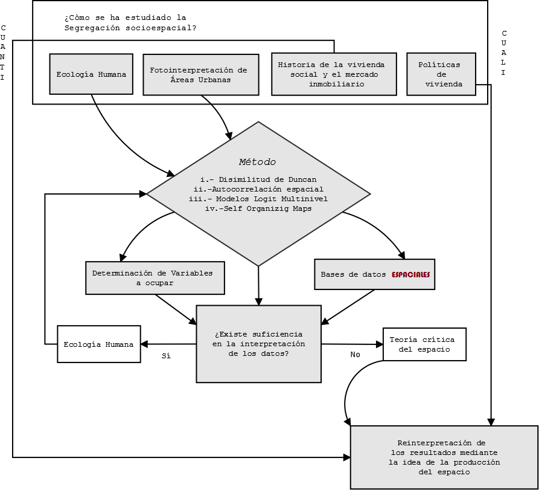

# Marco Metodológico

La segregación socioespacial se ha estudiado a partir de 4 formas. La ecología humana es en la que mayormente se frecuenta literatura, entendiendo la distribución de la segregación como causa natural. Otra forma es através de fotointerpretación de imágenes donde pueden verse los barrios con características de segregación (basurales, mala infraestructura urbana, cercanías a espacios industriales o en general cercanía a espacios no deseados). Una tercera forma es a partir de cómo el mercado y la planificación va segregando a quien adquieren residencia y esta tiene un componente histórico de quiénes han sido segregados por procesos políticos contextuales. Y por últimose puede evaluar a partir de cómo la política de vivienda social ha ido generando dichos patrones.

Los métodos que ocupan las dos primeras son cercanos a las metodologías cuantitativas que, sobretodo en la ecología del paisaje, el resultado de los modelos es en sí la segregación ignorando los motivos políticos existentes por detrás. Por ello para la ecología humana es suficiente dicha respuesta. Pero desde un punto de vista crítico al capitalismo, hay que interpretar los resultados de los modelos de segregación a partir del proceso histórico en el cual están contextualizados y es ahí donde la producción el espacio nos exije que se mire el rol simbólico e histórico del proceso en cuestión.